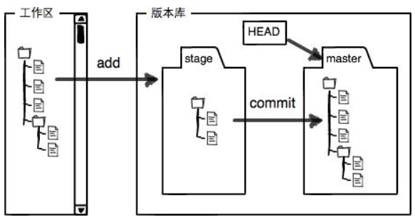

# 概述


# 操作流程

## 基础配置

```
git config --global user.name "Your Name"
git config --global user.email "email@example.com"
```

## 创建版本库（Repository）

也就是.git的隐藏文件夹

```
mkdir learngit
git init
```

## 把文件添加到版本库

```
cat > readme.txt
vim readme.txt
git add readme.txt
git commit -m "xxx"
```

## 远程连接github

1 在github官网新建版本库

2 建立本地与远程的连接

- `ssh-keygen -t rsa -b 4096 -C "邮箱"：目的是为了让本地机器ssh登录远程机器上的GitHub账户无需输入密码`

- `ssh-add ~/.ssh/id_rsa：将产生的新ssh key添加到ssh-agent`

<mark>注意：</mark>如果出现“Could not open a connection to your authentication agent.”：1）eval "$(ssh-agent -s)"；2）eval 'ssh-agent'

3 将SSH key 添加到GitHub账户

4 将本地仓库与远程仓库关联

```
git remote add origin git@github.com:lee683/learngit.git
```

5 取消本地仓库与远程仓库关联

```
git remote -v：查看远程库名
git remote rm 远程版本库名：取消关联
```

6 远程clone仓库：

```
git clone git@github.com:lee683/learngit.git
```

# 关键字

git add：把文件添加进去，实际上就是把文件修改添加到暂存区（stage）

git commit：提交更改，实际上就是把暂存区（stage）的所有内容提交到当前分支

git add命令实际上就是把要提交的所有修改放到暂存区（Stage），然后，执行git commit就可以一次性把暂存区的所有修改提交到分支



&nbsp;

```
git status：查看被修改项，查看已add未commit项
git diff / git diff xxx.txt：查看具体修改
git diff HEAD -- readme.txt：查看工作区和版本库里面最新版本的区别
git log：查看提交的commitid
```

&nbsp;

```
git reset --hard HEAD^：回退到HEAD指针指向的前一笔修改
git reset --hard commitid：回退到过去或者未来的某笔修改
git reflog：查看每一笔修改
```

```
git reset HEAD readme.txt：将暂存区中readme.txt的修改撤销掉（unstage），重新放回工作区
git checkout -- readme.txt：撤销工作区对于readme.txt的修改
```

&nbsp;

<mark>注意：删除操作</mark>

```
rm readme.txt：删除工作区的txt，但是版本库中文件还在
如果要删除版本库中txt，则：
git rm readme.txt
git commit -m "remove readme.txt"
如果要恢复readme.txt：
git checkout -- readme.txt
```

&nbsp;

git push -u origin master/git push origin master：由于远程库是空的，我们第一次推送`master`分支时，加上了`-u`参数，Git不但会把本地的`master`分支内容推送的远程新的`master`分支，还会把本地的`master`分支和远程的`master`分支关联起来，在以后的推送或者拉取时就可以简化命令。

### 修改分支名

1、重命名分支

```
git branch -m oldBranch newBranch
```

注意，如果修改的分支只是在本地，还没有推送到远程，只需要执行该操作即可。后面的操作步骤是针对已经推送到远程的分支。

2、删除远程分支

```
git push --delete origin oldBranch
```

3、上传新命名的本地分支

```
git push origin newBranch
```

4、本地分支与远程分支关联

```
git branch --set-upstream-to origin/newBranch
```

其中，第3、4步命令也可以直接用下面的命令代替。

```
git push -u origin newBranch
```

### push报错

[git报错：error: failed to push some refs to ... 的解决办法及如何让线上覆盖本地方法【Git/SVN】_@Umbrella的博客-CSDN博客](https://blog.csdn.net/Umbrella_Um/article/details/109855178)

# 总结

1  与远程库建立联系有两种方式

①github创建repositories -> 本地工作区git init -> git remote add建立二者联系。

②github创建repositories -> 本地工作区git clone远程仓库

注：第②种较为常用。

2  建立分支的两种方式

①本地git branch后push到远程，远程自动创建本地新建的branch

②在远程新建branch，本地git pull拉取最新分支，可切换新建的branch

注：第②种git pull后，本地执行git branch是不会显示pull下来的新分支，需要手动checkout过去后才能显示。
